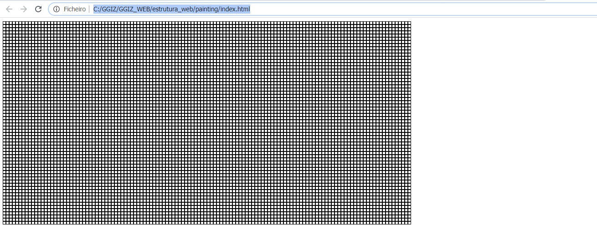
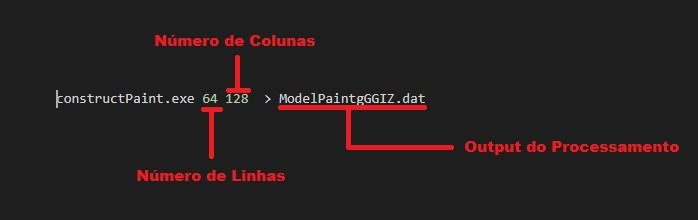

# Ferramentas de Apoio
Aqui estão disponiveis Ferramentas de Apoio para o desenvolvimento do GGIZ. Todas as Ferramentas foram desenvolvidas para essa finalidade. 
Caso seja necessário a outro projeto futuro, estará disponivel. Mas no ambiente do GGIZ terá que manter sua originalidade.

## Ferramentas Disponiveis

### ConstructPaint

Sua função é construir uma estrutura matricial com elementos do tipo div.    
 

 
Para efetuar a construção da estrutura execute o bat run disponivel no diretório construct. Os parâmetros do Arquivo bat podem ser editados 
conforme a necessidade do projeto.

Primeiro Parâmetro 
Número de Linhas da Estrutura
 

Segundo Parâmetro 
Número de Colunas da Estrutura
 

Terceiro Parâmetro 
Arquivo de Saída do Processamento
 

