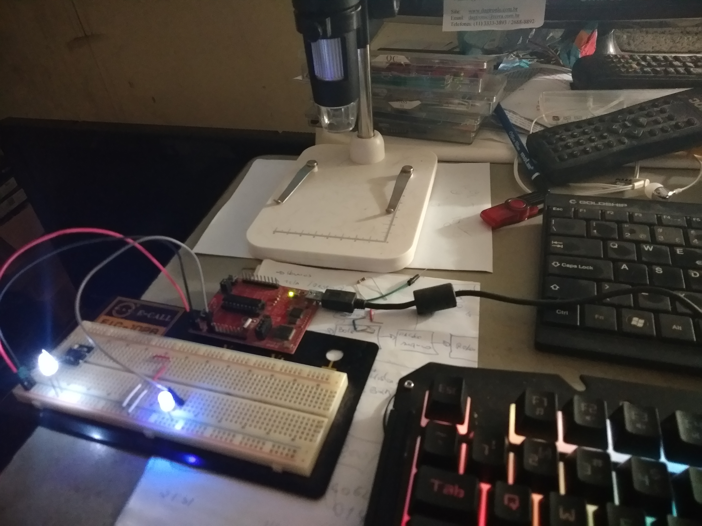

# TimeCalibrator
## Calibrador de Operação do Processamento 

Codificação do Calibrador de Hardware para Operação em 16MHz 
<br/>
No ambiente do GGIZ esse fonte terá que manter sua originalidade.

## Metodologia de Calculo

### __delay_cicle

A engenharia do calibrador está baseado na inclusão em C do método __delay_cicle. Esse método recebe como parâmetro um valor que define a frequência. Essa frequência informada
pode ser traduzido, como o tempo em que o processador ficará parado. Enquanto o ciclo de máquina estiver no período informado, o método nop() é chamado. Se tratando do GGIZ,
sua frequência de trabalho é de 16000000 HZ (16Mz). O que vale dizer que a cada segundo a maquina terá 16000000 ciclos. Onde o calculo 1/16000000, nos informa o tempo que cada 
ciclo de maquina ocorre. O resultado do calculo são 62,5 ns (nanosegundos), o que permite uma operação mais complexa. Lembrando que muitos periféricos exigem um delay entre suas
operações na ordem de milisegundos.
<br/>

### O Teste

O código fonte disponível, contempla apenas a calibração do hardware e um teste chamando um delay de 2 minutos. Essa estratégia foi usada, para uma melhor observção do sucesso 
na configuração do clock da máquina. Segue o trecho que possibilitou o teste ...
<br/>
```
CALL     #DELAY_2MIN
BIS.B    #BIT4, &P2OUT
```

O trecho de código acima, revela a operação onde o delay de 2 minutos é chamado, em seguida a porta 2.4 passa para nivel alto, acendendo um led.
<br/>

### Os Problemas

Não foi possivel observar o teste em modo Simulator. Não sei informar se é uma limitação da ferramenta, como tenho a Experimenter Board com o Microcontrolador disponivel, fiz
um teste direto. Outra situação que observei, que o processamento do delay não foi preciso. Como o gerador de clock é por software, acredito ter sido esse o problema. Mas esse 
é um aspecto que o hardware não precisa ser preciso.



<br/>

Trecho disponivel no código fonte
```
Autor: Weber Alves dos Santos (Pinablink)

Método de Programação do Tempo
16MHz <-> 1S
16000000 Ciclos de Maquina a Cada Segundo
1/16000000 = 62,5 ns = Tempo de um ciclo

Método em C
__delay_cicle (dcm)

Formula Para o Delay Cicle -> dcm = (te*f)

Onde:
te   = (tms / 1000)
tms  =  Valor do Tempo em Milisegundo 
1000 =  1 Segundo em Milisegundo 

dcm = Delay de Ciclo de Maquina
te  = Valor do tempo em espera por segundo
f   = Frequencia do Ciclo de Maquina

dcm = ((tms/1000) * f)
dcm = ((500/1000) * 16000000)    = 8000000    Hz
dcm = ((250/1000) * 16000000)    = 4000000    Hz  
dcm = ((100/1000) * 16000000)    = 1600000    Hz
dcm = ((10/1000)) * 16000000)    = 160000     Hz 
dcn = ((120000/1000) * 16000000) = 1920000000 Hz (Dois Minutos Para Teste de Hardware em Desenvolvimento)
```

